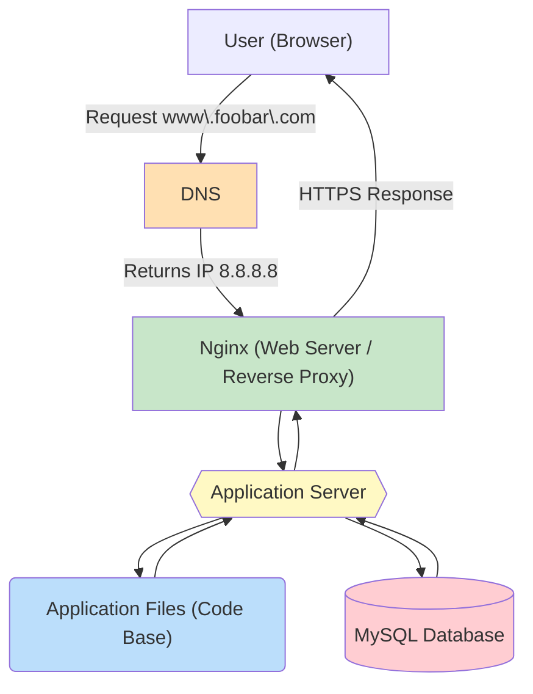

# Simple Web Stack – Explanation

## How the request flows

## How it works

Imagine a user wants to visit our website. They open their browser and type **<www.foobar.com>**.  

1. The browser asks the **DNS** server: “Hey, what IP address is `www.foobar.com`?”  
2. The DNS replies with the IP of our server, which is **8.8.8.8**.  
3. The browser now connects to our server at 8.8.8.8 and sends a request.  

---

## What’s on the server

On our single server, we have everything needed to run the website:

- **Web Server (Nginx)**: This is the first thing that receives the user’s request. It serves static files like images or CSS and also acts as a reverse proxy, forwarding dynamic requests to the application server.  
- **Application Server**: This is where the code of the website actually runs. It takes the request, runs the logic, and generates the right content for the user.  
- **Application Files**: These are the code files of our website, like HTML, PHP, or other scripts.  
- **Database (MySQL)**: This stores all the data, like users, posts, or any other information the website needs. The application server queries it to get or save data.  

---

## Key Concepts

- **Server**: A machine that stores and runs all services for the website.

- **Domain Name**: Provides an easy-to-remember address instead of using the IP.

- **DNS Record (www)**: Usually an A record that points <www.foobar.com> to the server IP (8.8.8.8).

- **Web Server**: Handles HTTP/HTTPS requests, serves static content, and forwards dynamic requests to the application server.

- **Application Server**: Executes the website logic and processes data.

- **Database**: Stores persistent data and allows the application server to read/write it.

- **Communication**: Between the server and the user’s browser, the server uses HTTP/HTTPS over TCP/IP.

---

## Limitations / Issues

**Single Point of Failure (SPOF)**:

Everything is on a single server. If it goes down, the entire website becomes unavailable.

**Downtime during maintenance**:

Restarting the web server, application server, or database for updates will make the site temporarily inaccessible.

**No scalability**:

The server has a limited capacity. High traffic can overwhelm it, causing slow responses or crashes.

**Security considerations**:

No firewall or monitoring is configured. All services are exposed on a single server.
