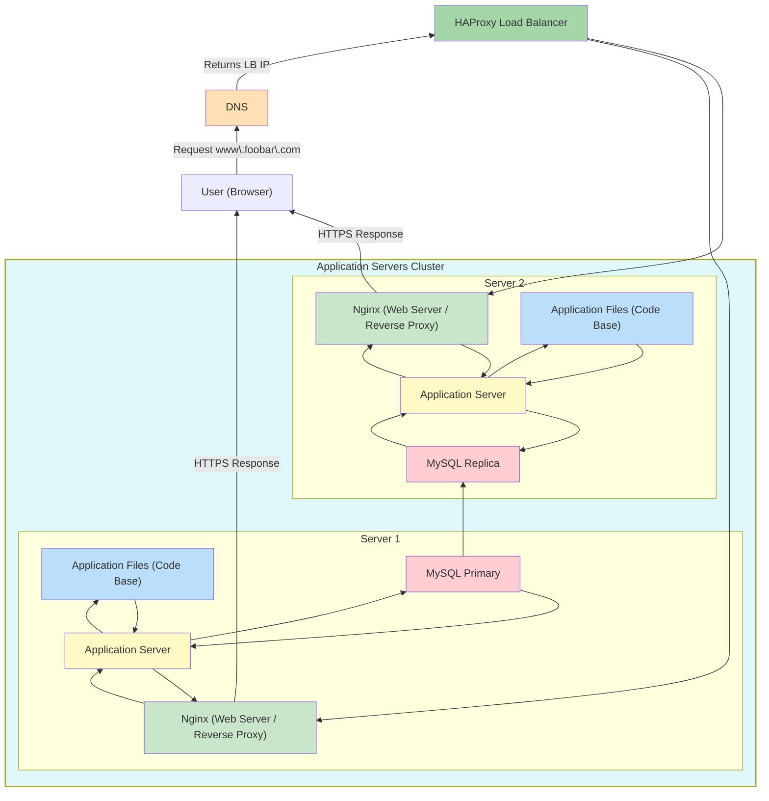

# Distributed Web Infrastructure – Explanation

## How the request flows

## How it works

Now, we improve our simple web stack by distributing it across multiple servers. The website is still <www.foobar.com>
, but instead of a single server, we now have:

A Load Balancer (HAProxy) that receives all incoming requests.

Two servers, each containing:

Web Server (Nginx)

Application Server

Application Files

Database (MySQL)

Here’s how a request works:

The browser asks the DNS server: “What IP address is <www.foobar.com>?”

The DNS responds with the IP of the Load Balancer.

The browser connects to the Load Balancer, which distributes the request to one of the two servers.

## What’s on the servers

Each of the two servers contains everything needed to process requests independently:

Web Server (Nginx): Receives requests from the Load Balancer, serves static files, and forwards dynamic requests to the application server.

Application Server: Runs the website logic and generates responses.

Application Files: The code base of the website.

Database (MySQL): Stores website data. We use a Primary-Replica setup:

Primary: handles write operations.

Replica: receives updates from the Primary and can serve read requests to reduce load.

## Key Concepts

Load Balancer (HAProxy): Distributes traffic between multiple servers to improve availability and reduce overload.

Distribution Algorithm (Round Robin): Each new request is sent to the next server in order, cycling continuously.

Active-Active vs Active-Passive Load Balancer:

Active-Active: Both load balancers handle traffic simultaneously.

Active-Passive: One load balancer is standby and only takes over if the active one fails.

Primary-Replica Database Cluster:

Primary accepts writes; replica handles reads and keeps synchronized with the primary.

Helps scale database reads and improve fault tolerance.

Application Servers: Run the website independently, reducing the risk that one failure takes down everything.

## Limitations / Issues

Single Point of Failure (SPOF):

The Load Balancer is still a single point of failure unless we cluster it.

Security issues:

No firewall or HTTPS configured. Traffic is unencrypted and servers are exposed.

No monitoring:

Performance metrics and alerts are not collected yet.
