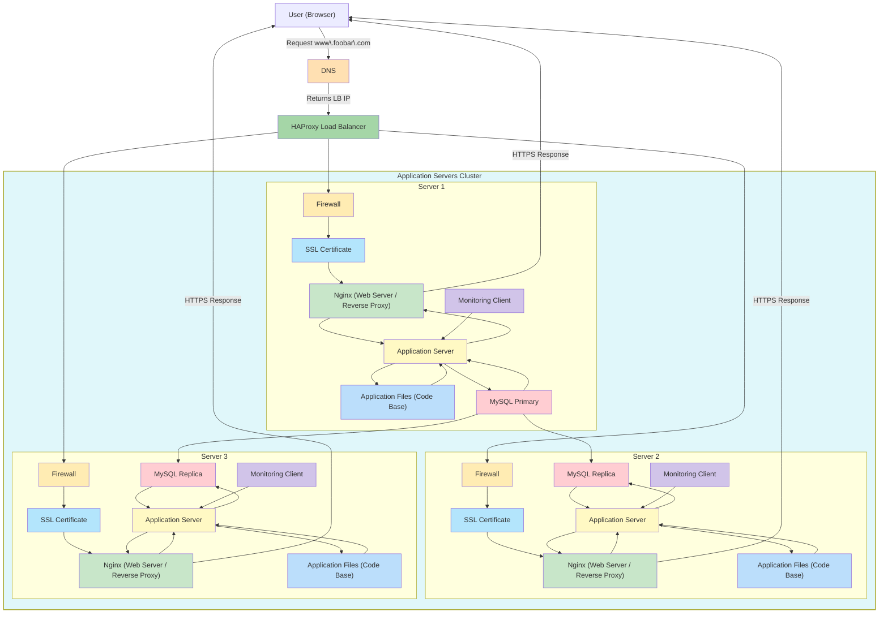

# Secured and Monitored Web Infrastructure – Explanation

## How the request flows

### How it works

In Task 2, we take the distributed web infrastructure from Task 1 and **add security and monitoring**.

1. The user opens their browser and types **<www.foobar.com>**.  
2. The DNS resolves the domain to the **Load Balancer IP**.  
3. The request goes to the **HAProxy Load Balancer**, which forwards it to one of the two servers.  
4. Each server has a **web server, application server, application files, and database**.  
5. We now add **firewalls**, **SSL encryption**, and **monitoring clients** to secure and observe the system.  

---

## What’s on the servers

- **Web Server (Nginx)**: Receives requests and forwards them to the application server. Now, it serves traffic over **HTTPS** using an SSL certificate.  
- **Application Server**: Runs the website logic and communicates securely with the database.  
- **Application Files**: The code base of the website.  
- **Database (MySQL)**: Primary-Replica setup remains the same, with writes going to the primary and reads possibly served by the replica.  

---

## Additional Components and Why

- **Firewalls** (one per server):  
  - Control which traffic can enter and leave the server.  
  - Protect servers from unauthorized access.  
- **SSL Certificate**:  
  - Encrypts all traffic between users and the servers.  
  - Protects sensitive data like passwords or personal information.  
- **Monitoring Clients** (one per server):  
  - Collect metrics such as CPU, memory, disk usage, and request counts.  
  - Send data to a monitoring service (e.g., Sumologic) for analysis and alerting.  

---

## Key Concepts

- **Firewalls**: Allow only authorized traffic, block malicious requests.  
- **HTTPS / SSL**: Encrypts data in transit so attackers cannot sniff it.  
- **Monitoring**: Provides visibility into server performance and application behavior.  
- **Primary-Replica Database**: Primary still handles writes; replica handles reads and keeps data in sync.  
- **Load Balancer**: Continues to distribute traffic across the two servers.  

---

## Limitations / Issues

- **SSL Termination at Load Balancer**:  
  - If SSL is terminated at HAProxy, traffic between HAProxy and servers might be unencrypted.  
- **Single Primary Database**:  
  - Only one server can accept writes; if it fails, writes cannot be processed.  
- **Servers with identical components**:  
  - Each server has web, application, and database. This can be inefficient and harder to scale individually.  
- **Still some security risks**:  
  - Only basic firewalls; other measures like intrusion detection are not implemented.  

---

This architecture **improves security and observability** compared to Task 1.  
Traffic is now encrypted, servers are protected by firewalls, and metrics are collected for monitoring.  

Next, we can **update the diagram** to include the firewalls, SSL, and monitoring clients, while keeping the same cluster and server structure.
