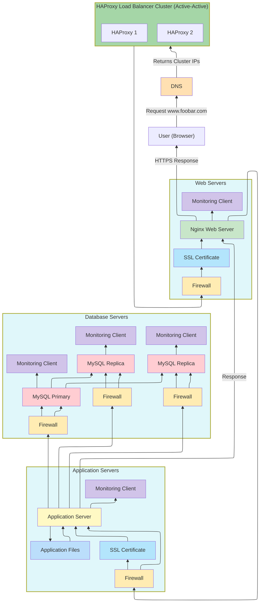

# Scale Up Web Infrastructure – Explanation

## How the request flows

## How it works

In Task 3, we take the secured and monitored infrastructure from Task 2 and **scale up** by splitting components across different servers and adding a second load balancer for high availability.

1. The user opens their browser and types **<www.foobar.com>**.  
2. The DNS resolves the domain to the **Load Balancer Cluster IPs**.  
3. The request goes to one of the **HAProxy Load Balancers**, which distribute traffic to the appropriate servers.  
4. Servers are now **split by role**:
   - **Web Server** server(s) – handle HTTP/HTTPS requests.  
   - **Application Server** server(s) – run the website logic and application code.  
   - **Database Server** server(s) – host the Primary and Replica databases.  
5. Security (firewalls), SSL, and monitoring clients remain in place for each server.

---

## What’s on the servers

- **Web Server(s)**: Only handle incoming requests and forward them to the application server(s).  
- **Application Server(s)**: Execute the website logic, query the database servers, and return results.  
- **Database Server(s)**: Primary-Replica configuration; Primary handles writes, Replicas handle reads.  
- **Firewalls**: Control incoming and outgoing traffic per server.  
- **SSL Certificates**: Encrypt traffic between users and servers.  
- **Monitoring Clients**: Collect metrics on each server and send to the monitoring service.  

---

## Key Concepts

- **Separation of roles**: Improves scalability and performance. Each server focuses on one task.  
- **Load Balancer Cluster**: Multiple HAProxy nodes in Active-Active mode for high availability.  
- **Primary-Replica Database**: Maintains data integrity while allowing read scaling.  
- **Monitoring and Security**: Ensures we can track performance and protect the infrastructure.

---

## Limitations / Issues

- **Complexity**: More servers mean more management overhead.  
- **Database writes**: Still limited to the Primary DB; failover needs to be handled carefully.  
- **Networking**: More traffic between servers; requires proper network configuration.  
- **Monitoring**: Must be configured to collect metrics from multiple servers efficiently.

---

This architecture **improves scalability and availability** compared to Task 2.  
By splitting servers by role and adding a second load balancer, the system can handle higher traffic and avoid some single points of failure.
